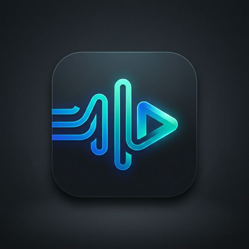

<p align="center">
  
</p>

<h1 align="center">Neu Music Platform</h1>

<p align="center">
  <a href="https://github.com/Pns2051/neu/actions"></a>
  <a href="https://github.com/Pns2051/neu/releases"></a>
  <a href="LICENSE"></a>
  <a href="#"></a>
</p>

<p align="center">
  <b>A high-performance, modular music client for Linux. Built with C++ and Qt6.</b>
</p>

<p align="center">
  
  <br />
  <i>Tracks downloaded by premium users!</i>
</p>

---

<p align="center">
  
</p>

## 🚀 Key Features

- **🚀 High Performance**: Native C++ logic with `QtMultimedia` (GStreamer/ALSA/PipeWire) for ultra-low latency.
- **🎨 MD3 Glassmorphism**: A stunning, modern UI built with Qt Quick (QML).
- **🔑 Social Login**: Integrated YouTube and Spotify OAuth2 for your personal library.
- **📜 Synced Lyrics**: Real-time lyrics fetching from the LRCLIB API.
- **🤖 Intelligence**: On-device vector similarity engine for privacy-first recommendations.
- **🤝 Social Presence**: Built-in Discord Rich Presence integration.

## 🏗️ Technical Stack

- **GUI**: Qt 6.6+ / QML
- **Audio**: Qt Multimedia / miniaudio
- **Networking**: QNetworkAccessManager / QOAuth2
- **Persistence**: SQLite (Qt Sql)
- **Packaging**: .deb, .rpm, AppImage, Snap, Flatpak

## 📦 Installation (Linux)

### Automated Build (Recommended)
Our **One-Button Update** script handles everything:
```bash
./push_update.sh
```

### Manual Build
```bash
mkdir build && cd build
cmake .. -DCMAKE_BUILD_TYPE=Release
make -j$(nproc)
./neu-cpp
```

## 🌍 Distribution

Neu is available across all major Linux formats:
- **Flatpak**: `flatpak install flathub org.neu.Neu`
- **Snap**: `snap install neu-music`
- **AppImage**: Download from [Releases](https://github.com/Pns2051/neu/releases)

---

## 🤝 Community

We welcome contributors! Check [CONTRIBUTING.md](./CONTRIBUTING.md) to get started.

<p align="center">
  <i>Stay tuned for more updates!</i><br />
  
</p>
